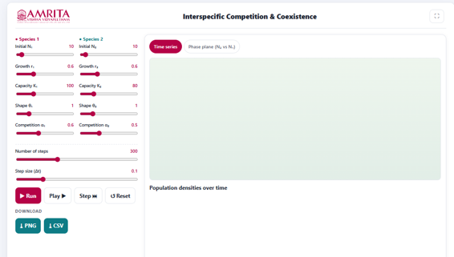
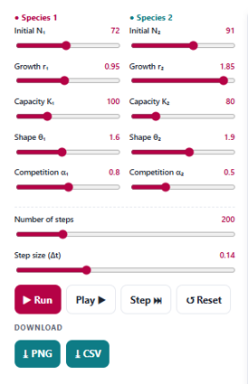
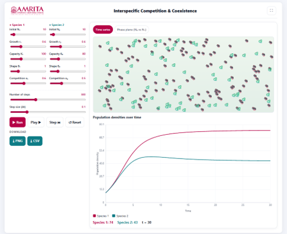

### Procedure:

1. The simulator models interspecific competition using an age-independent population growth framework in which two species compete for shared resources. The model allows users to investigate how intrinsic growth rates, carrying capacities, and competition coefficients influence competitive exclusion, stable coexistence, or dominance of one species over the other.

&nbsp;

2. User can open the simulator window. The simulator provides controls for defining the initial population and competition parameters of two interacting species. Users can modify the model parameters, execute the simulation, visualize the population dynamics using either a Time Series or Phase Plane plot, and export the generated results for further analysis.	

&nbsp;

3. The left panel of the simulator contains adjustable model parameters for two competing species, while the right panel displays the graphical simulation results.

&nbsp;

4. User can the set the initial population size (N₁) for Species 1 by moving the corresponding slider. This parameter defines the starting population density of Species 1 at the beginning of the simulation. Likewise set the initial population size (N₂) for Species 2 using the corresponding slider. This value specifies the initial population density of Species 2 and serves as the initial condition for the competitive interaction.

&nbsp;

5. Adjust the intrinsic growth rates (r₁ and r₂) for both species using their respective sliders. The intrinsic growth rate determines the maximum rate at which each population increases under ideal environmental conditions in the absence of competition.

&nbsp;

6. Specify the carrying capacities (K₁ and K₂) for Species 1 and Species 2. The carrying capacity represents the maximum population size that the environment can sustainably support for each species.

&nbsp;

7. Set the shape parameters (θ₁ and θ₂). These parameters influence the form of the population growth function and modify the response of each species to density-dependent regulation.

&nbsp;

8. Define the competition coefficients (α₁₂ and α₂₁) using the corresponding sliders. The coefficient α1and α2 represents the competitive effect of Species 2 on Species 1, α2 and α1 represents the competitive effect of Species 1 on Species 2. These parameters determine the strength of interspecific competition within the model.

&nbsp;

9. Specify the total number of simulation steps by adjusting the Number of steps slider. This parameter determines the duration of the simulation and the total number of computational iterations performed.

&nbsp;

10. Adjust the simulation time interval (Δt) using the Step size slider. The step size defines the time increment between successive simulation calculations and influences the temporal resolution of the results.

&nbsp;

11. Click the Run button to execute the simulation using the selected parameter values. The simulator computes the population dynamics of both species and generates the corresponding graphical outputs.

&nbsp;

12. After executing the simulation, the Time Series view displays the temporal changes in the population densities of the two competing species. 

&nbsp;

13. User can observe the animation panel displayed above the graph. The panel provides a visual representation of the simulated populations, illustrating the distribution and movement of individuals of both species throughout the simulation.

&nbsp;

14. Examine the Time Series graph displayed below the animation panel. The graph illustrates the changes in population densities of Species 1 and Species 2 throughout the simulation period.

&nbsp;

15. Interpret the X-axis (Time) to determine the progression of the simulation and the Y-axis (Population density) to observe changes in the population sizes of both species. Differentiate the population trajectories using the graph legend. Each coloured curve corresponds to one of the two competing species.

&nbsp;

16. Observe the population trends during the simulation. Compare the rates of population growth, stabilization, or decline exhibited by each species. Monitor the population values displayed beneath the graph, which indicate the current population density of each species and the corresponding simulation time.

&nbsp;

17. Alternatively, click the Play button to replay the simulation continuously or Step to advance the simulation one iteration at a time for detailed observation.

&nbsp;

18. Modify one or more model parameters and repeat the simulation to investigate how changes in growth rate, carrying capacity, competition coefficients, or initial population size influence the population dynamics.

&nbsp;

19.	Download the simulation results by clicking the PNG button to save the graphical output or the CSV button to export the numerical simulation data for further analysis.

&nbsp;

20. Repeat the above procedure using different combinations of parameter values to investigate how variations in initial population sizes, growth rates, carrying capacities, and competition coefficients influence species coexistence, competitive exclusion, and overall population dynamics.
