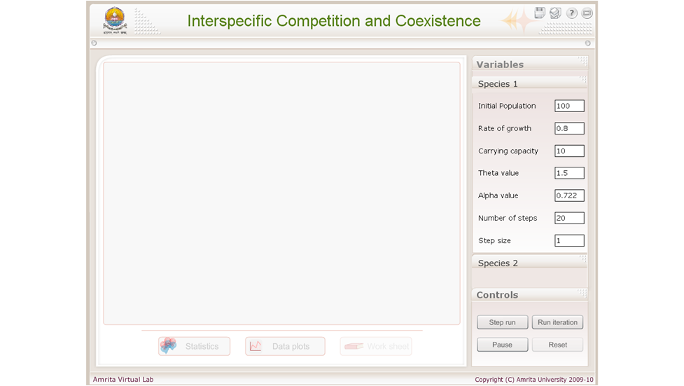
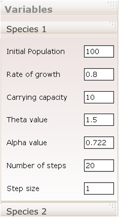
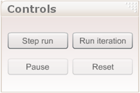

### Procedure:
The simulator consists of three regions, Input Variables Menu, Simulation control buttons and Result display window. 

&nbsp;

#### Input Variables Menu:
 
Input variables menu section contains two sub tabs: Parameters for Species 1 and Parameters for Species 2. The user can change the values according to his/her choice and observe the changes in the result display window. Below shown is for the Species 1. 

&nbsp;

The user can change Initial Population, Rate of growth, Carrying capacity, Theta value, Alpha value, Number of steps and step size according to his/her choice for species 1. The below mentioned screenshot is to change the parameters for the tab “Species 2”.

&nbsp;

The user can change Initial Population, Rate of growth, Carrying capacity, Theta value, Alpha value, Number of steps and step size according to his/her choice for Species 2.

#### Simulation Control Buttons:

The above controls section contains buttons related to “Step run”, “Run iteration”, “Pause” and “Reset”. The simulation can be started by clicking on “Run iteration” button. The simulation can be paused by clicking on “Pause” and can be re-setted using “Reset” button.
