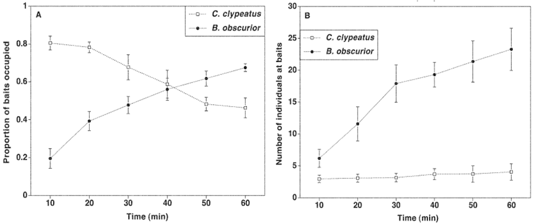

### Theory

Major focus in community ecology is about understanding the factors underlying species coexistence (Carrete et al). When dealing with competition between native and exotic species, the competitive exclusion of the ‘weaker’ species can have consequences for biodiversity conservation (Carrete et al). It is important to know whether this kind of interaction between species leads to exclusion of one species or results in their co-existence (Sommer & Worm, 2002). Food resources are always limited and maintained below the carrying capacity of the surrounding environment to avoid the population exploitation. Species living in the same habitat would have a problem of overlap in their food resources due to their limited availability. When this happens, the two species compete and tries to drive the other species away. This does not mean that the other species cannot survive in that habitat; it can exist by developing certain adaptive features. A detailed research is conducted on inter-specific competition and coexistence by Morrison, 2002 on three species, namely Caenobita clypeatus (Herbst), Brachymyrmex obscurior Forel and Dorymyrmex pyramicus Roger. Out of these three species, B. obscurior Forel and D. pyramicus Roger are two different ant species and C. clypeatus is a Hermit Crab. This inter-specific competition is between these three species, wherein either of the ant species interacts with the crab but not both.

 

The available food resources for them are majorly overlapped, considering the fact that all these three species are generalist scavengers. So, competition between these species develops for the limited food resources. The studies were done for four years and it was noted that C. clypeatus is good in recognizing its food source very quickly while the B. obscurior recognizes the food source rather slowly. So, C. clypeatus has advantage of getting to its food source earlier than the B. obscurior. However, it so happens that B. obscurior finally would be successful in having the food source. The reason is that once B. obscurior identified the source, it assists several workers along with it so that they can defeat any other species coming for the food source. These workers are generally aggressive and start attacking the other species near to the food sources. Considering the above fact, it becomes obvious that C. clypeatus would be successful in reaching first to its food source but would be driven from the source once B. obscurior identifies the source. The data plots obtained from the experiments done on these species were shown in Fig. 1 (taken from Morrison, 2002). From the figure you can observe that in initial stages, C. clypeatus number reaching to its baits is maximum, but then dominated by the B. obscurior in later stages.

 

The other ant species D. pyramicus is also the competitor to C. clypeatus but this is not as successful as B. obscurior. It’s mainly because unlike B. obscurior D.pyramicus does not assist workers along with it and when contradicted with C. clypeatus, it can be easily driven off. But still D. pyramicus has the ability to locate the food source at the earliest like C. clypeatus but could not drive off the other competitors like B. obscurior.

 

Mathematically to model such a process requires classic Lotka-Volterra equations. The negative effect created by one species on another could be shown by adding an extra term in the original equation. The Lotka-Volterra equation takes the form as:

&nbsp;

Mathematically to model such a process requires classic Lotka-Volterra equations. The negative effect created by one species on another could be shown by adding an extra term in the original equation. The Lotka-Volterra equation takes the form as:

&nbsp;
Where, rm(1) is the maximum rate of growth per individual for species 1,

N1 is the number of individuals of species 1,

K1 is the carrying capacity of the species 1,

N2 is the number of individuals of species 2,

α12 is the effect of an individual of species 2 on an individual of species 1

Likewise, for the species 2, the equation is used as,

&nbsp;

Where, rm(2) is the maximum rate of growth per individual for species 2,

N2 is the number of individuals of species 2,

K2 is the carrying capacity of the species 2,

N1 is the number of individuals of species 1,

α21 is the effect of an individual of species 1 on an individual of species 2

 

The above equations defined show the growth rate of the individuals for two different species (species 1 and species 2).

 

If the competition between these species happens in the above mentioned manner, how were they able to coexist in the same geographical location? The ability to their coexistence depends on their developed adaptive features which are distinct to each other. C. clypeatus and D. pyramidus were good in locating their food source at the earliest so they get to the source earlier. On the other hand, B. obscurior recognizes its source rather slowly but once identified, it behaves aggressively towards its competitors and drives them off.

 

As there is time delay for B. obscurior to recognize its source, C. clypeatus and D. pyramidus has an advantage to have the food sources before it reaches. While D. pyramidus does not recruit workers along with it, its chances to defend itself from the competitors are rather difficult. Likewise, these different species exist on the same geographical location and compete for the available food sources.

&nbsp;

(Adapted from Morrison, 2002)

Figure 1. Statistical plots showing the varying dynamics with respect to time between the two species C. clypeatus and B. obscurior.